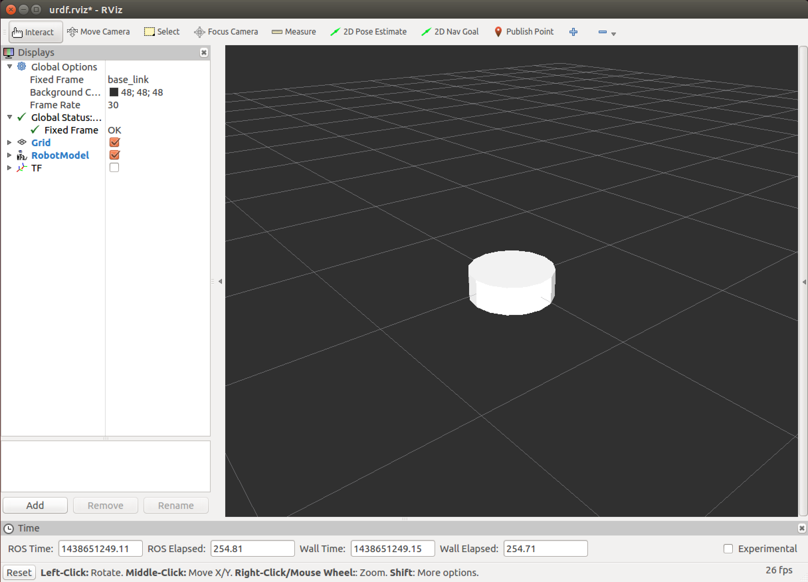

Build MyTurtle From Scratch
===
### Setup
```python
# Go to catkin workspace
$ cd ~/catkin_ws/src

# Create a directory to include packages related to myturtle
$ mkdir myturtle

# Create Description and Gazebo packages
$ cd myturtle
$ catkin_create_pkgs myturtle_description
$ catkin_create_pkgs myturtle_gazebo

# Add essential folders for description package
$ cd ~/catkin_ws/src/myturtle/myturtle_description
$ mkdir urdf rviz

# Add essential folders for description package
$ cd ~/catkin_ws/src/myturtle/myturtle_gazebo
$ mkdir launch
```
### Build MyTurtle Base
#### File Hierachy
```python
~/catkin_ws/src/myturtle
  myturtle_description
    urdf
      myturtle_base.urdf.xacro
    rviz
      urdf.rviz
  myturtle_gazebo
    launch
      display.launch
```
#### Setting Up Launch File
We create a launch file to load essentials such as robot model and rviz configuration
```xml
<!-- display.launch -->
<launch>

  <!-- load description of robot model -->
  <arg name="model" default="$(find myturtle_description)/urdf/myturtle_base.urdf.xacro"/>
  <arg name="gui" default="true" />
  <arg name="rvizconfig" default="$(find myturtle_description)/rviz/urdf.rviz" />

  <param name="robot_description" command="$(find xacro)/xacro.py $(arg model)" />
  <param name="use_gui" value="$(arg gui)"/>

  <node name="joint_state_publisher" pkg="joint_state_publisher" type="joint_state_publisher" />
  <node name="robot_state_publisher" pkg="robot_state_publisher" type="state_publisher" />
  <!-- open rviz -->
  <node name="rviz" pkg="rviz" type="rviz" args="-d $(arg rvizconfig)" required="true" />

</launch>
```
#### Rviz Configuration File (urdf.rviz)
We will create a rviz configuration to load the robot model when we launch our robot
```
Panels:
  - Class: rviz/Displays
    Help Height: 78
    Name: Displays
    Property Tree Widget:
      Expanded:
        - /Global Options1
        - /Status1
      Splitter Ratio: 0.5
    Tree Height: 565
  - Class: rviz/Selection
    Name: Selection
  - Class: rviz/Tool Properties
    Expanded:
      - /2D Pose Estimate1
      - /2D Nav Goal1
      - /Publish Point1
    Name: Tool Properties
    Splitter Ratio: 0.588679
  - Class: rviz/Views
    Expanded:
      - /Current View1
    Name: Views
    Splitter Ratio: 0.5
  - Class: rviz/Time
    Experimental: false
    Name: Time
    SyncMode: 0
    SyncSource: ""
Visualization Manager:
  Class: ""
  Displays:
    - Alpha: 0.5
      Cell Size: 0.5
      Class: rviz/Grid
      Color: 160; 160; 164
      Enabled: true
      Line Style:
        Line Width: 0.03
        Value: Lines
      Name: Grid
      Normal Cell Count: 0
      Offset:
        X: 0
        Y: 0
        Z: 0
      Plane: XY
      Plane Cell Count: 20
      Reference Frame: <Fixed Frame>
      Value: true
    - Alpha: 1
      Class: rviz/RobotModel
      Collision Enabled: false
      Enabled: true
      Links:
        {}
      Name: RobotModel
      Robot Description: robot_description
      TF Prefix: ""
      Update Interval: 0
      Value: true
      Visual Enabled: true
    - Class: rviz/TF
      Enabled: true
      Frame Timeout: 15
      Frames:
        All Enabled: true
      Marker Scale: 1
      Name: TF
      Show Arrows: true
      Show Axes: true
      Show Names: true
      Tree:
        {}
      Update Interval: 0
      Value: true
  Enabled: true
  Global Options:
    Background Color: 48; 48; 48
    Fixed Frame: /base_link
  Name: root
  Tools:
    - Class: rviz/Interact
      Hide Inactive Objects: true
    - Class: rviz/MoveCamera
    - Class: rviz/Select
    - Class: rviz/FocusCamera
    - Class: rviz/Measure
    - Class: rviz/SetInitialPose
      Topic: /initialpose
    - Class: rviz/SetGoal
      Topic: /move_base_simple/goal
    - Class: rviz/PublishPoint
      Single click: true
      Topic: /clicked_point
  Value: true
  Views:
    Current:
      Class: rviz/Orbit
      Distance: 10
      Focal Point:
        X: 0
        Y: 0
        Z: 0
      Name: Current View
      Near Clip Distance: 0.01
      Pitch: 0.465398
      Target Frame: <Fixed Frame>
      Value: Orbit (rviz)
      Yaw: 0.885398
    Saved: ~
Window Geometry:
  Displays:
    collapsed: false
  Height: 882
  Hide Left Dock: false
  Hide Right Dock: false
  QMainWindow State: 000000ff00000000fd00000004000000000000013c000002c4fc0200000008fb0000001200530065006c0065006300740069006f006e00000001e10000009b0000006400fffffffb0000001e0054006f006f006c002000500072006f007000650072007400690065007302000001ed000001df00000185000000a3fb000000120056006900650077007300200054006f006f02000001df000002110000018500000122fb000000200054006f006f006c002000500072006f0070006500720074006900650073003203000002880000011d000002210000017afb000000100044006900730070006c0061007900730100000028000002c4000000dd00fffffffb0000002000730065006c0065006300740069006f006e00200062007500660066006500720200000138000000aa0000023a00000294fb00000014005700690064006500530074006500720065006f02000000e6000000d2000003ee0000030bfb0000000c004b0069006e0065006300740200000186000001060000030c00000261000000010000010f000002c4fc0200000003fb0000001e0054006f006f006c002000500072006f00700065007200740069006500730100000041000000780000000000000000fb0000000a005600690065007700730100000028000002c4000000b000fffffffb0000001200530065006c0065006300740069006f006e010000025a000000b200000000000000000000000200000490000000a9fc0100000001fb0000000a00560069006500770073030000004e00000080000002e10000019700000003000004b00000003efc0100000002fb0000000800540069006d00650100000000000004b0000002f600fffffffb0000000800540069006d0065010000000000000450000000000000000000000259000002c400000004000000040000000800000008fc0000000100000002000000010000000a0054006f006f006c00730100000000ffffffff0000000000000000
  Selection:
    collapsed: false
  Time:
    collapsed: false
  Tool Properties:
    collapsed: false
  Views:
    collapsed: false
  Width: 1216
  X: 53
  Y: 60
```

#### Build the Base
```xml
<!-- myturtle_base.urdf.xacro -->
<?xml version="1.0"?>
<robot name="myturtle" xmlns:xacro="httpL//ros.org/wiki/xacro">
  <link name="base_footprint"/>
  <link name="base_link">
    <visual>
      <geometry>
        <cylinder length="0.1" radius="0.15"/>
      </geometry>
      <material name="white">
        <color rgba="1 1 1 1"/>
      </material>
    </visual>
  </link>
  <joint name="base_joint" type="fixed">
    <parent link="base_footprint"/>
    <child link="base_link"/>
    <origin xyz="0 0 0" rpy="0 0 0"/>
  </joint>
</robot>
```
The Base should look similar to this in rviz. If you see some axis that shows the tf, you could turn it off by unchecking the tf option on the left
<br></br>


#### Add Left Wheel and Right Wheel
```xml
<!-- myturtle_base.urdf.xacro -->
<?xml version="1.0"?>
<robot name="myturtle" xmlns:xacro="httpL//ros.org/wiki/xacro">
  <!-- <xacro:property name="" value=""/> -->
  <xacro:property name="M_PI" value="3.1415926535897931"/>

  <xacro:property name="base_collision_height" value="0.1"/>
  <xacro:property name="base_collision_radius" value="0.15"/>
  <xacro:property name="wheel_thickness" value="0.01"/> <!-- 1 cm = 0.01 m -->
  <xacro:property name="wheel_radius" value="0.045"/> <!-- diameter = 9 cm -->
  <xacro:property name="wheels_distance" value="0.2644"/>
  <xacro:property name="wheel_center_offset" value="-0.0278"/> <!-- where center of the motor locate at relative to the base plate -->
  <xacro:property name="caster_wheels_distance" value="0.25"/>
  <xacro:property name="caster_wheel_length" value="0.02"/>
  <xacro:property name="caster_wheel_radius" value="0.01"/>
  <xacro:property name="base_offset_from_ground" value="${wheel_radius - wheel_center_offset}"/>
  <xacro:property name="caster_wheel_center_offset" value="-${base_offset_from_ground + (base_collision_height/2) - caster_wheel_radius}"/>


  <link name="base_footprint"/>
  <link name="base_link">
    <visual>
      <geometry>
        <cylinder length="${base_collision_height}" radius="${base_collision_radius}"/>
      </geometry>
      <material name="white">
        <color rgba="1 1 1 1"/>
      </material>
    </visual>
  </link>

  <joint name="base_joint" type="fixed">
    <parent link="base_footprint"/>
    <child link="base_link"/>
    <origin xyz="0 0 ${base_collision_height/2}" rpy="0 0 0"/>
  </joint>

  <link name="left_wheel_link">
    <visual>
      <geometry>
        <cylinder length="${wheel_thickness}" radius="${wheel_radius}"/>
      </geometry>
      <origin xyz="0 0 0" rpy="0 0 0"/>
      <material name="blue">
        <color rgba="0 0 0.8 1"/>
      </material>
    </visual>
  </link>

  <joint name="left_wheel_joint" type="continuous">
    <parent link="base_link"/>
    <child link="left_wheel_link"/>
    <origin xyz="0 ${wheels_distance/2} ${wheel_center_offset-base_collision_height/2}" rpy="${M_PI/2} 0 0"/>
    <axis xyz="0 0 1"/>
  </joint>

  <link name="right_wheel_link">
    <visual>
      <geometry>
        <cylinder length="${wheel_thickness}" radius="${wheel_radius}"/>
      </geometry>
      <origin xyz="0 0 0" rpy="0 0 0"/>
      <material name="blue">
        <color rgba="0 0 0.8 1"/>
      </material>
    </visual>
  </link>

  <joint name="right_wheel_joint" type="continuous">
    <parent link="base_link"/>
    <child link="right_wheel_link"/>
    <origin xyz="0 -${wheels_distance/2} ${wheel_center_offset-base_collision_height/2}" rpy="${M_PI/2} 0 0"/>
    <axis xyz="0 0 1"/>
  </joint>
</robot>

```

#### Add Front and Back Caster Wheels
```xml
<!-- myturtle_base.urdf.xacro -->
<?xml version="1.0"?>
<robot name="myturtle" xmlns:xacro="httpL//ros.org/wiki/xacro">
  <!-- <xacro:property name="" value=""/> -->
  <xacro:property name="M_PI" value="3.1415926535897931"/>

  <xacro:property name="base_collision_height" value="0.1"/>
  <xacro:property name="base_collision_radius" value="0.15"/>
  <xacro:property name="wheel_thickness" value="0.01"/> <!-- 1 cm = 0.01 m -->
  <xacro:property name="wheel_radius" value="0.045"/> <!-- diameter = 9 cm -->
  <xacro:property name="wheels_distance" value="0.2644"/>
  <xacro:property name="wheel_center_offset" value="-0.0278"/> <!-- where center of the motor locate at relative to the base plate -->
  <xacro:property name="caster_wheels_distance" value="0.25"/>
  <xacro:property name="caster_wheel_length" value="0.02"/>
  <xacro:property name="caster_wheel_radius" value="0.01"/>
  <xacro:property name="base_offset_from_ground" value="${wheel_radius - wheel_center_offset}"/>
  <xacro:property name="caster_wheel_center_offset" value="-${base_offset_from_ground + (base_collision_height/2) - caster_wheel_radius}"/>

  <link name="base_footprint"/>
  <link name="base_link">
    <visual>
      <geometry>
        <cylinder length="${base_collision_height}" radius="${base_collision_radius}"/>
      </geometry>
      <material name="white">
        <color rgba="1 1 1 1"/>
      </material>
    </visual>
  </link>

  <joint name="base_joint" type="fixed">
    <parent link="base_footprint"/>
    <child link="base_link"/>
    <origin xyz="0 0 ${base_collision_height/2}" rpy="0 0 0"/>
  </joint>


  <link name="left_wheel_link">
    <visual>
      <geometry>
        <cylinder length="${wheel_thickness}" radius="${wheel_radius}"/>
      </geometry>
      <origin xyz="0 0 0" rpy="0 0 0"/>
      <material name="blue">
        <color rgba="0 0 0.8 1"/>
      </material>
    </visual>
  </link>

  <joint name="left_wheel_joint" type="continuous">
    <parent link="base_link"/>
    <child link="left_wheel_link"/>
    <origin xyz="0 ${wheels_distance/2} ${wheel_center_offset-base_collision_height/2}" rpy="${M_PI/2} 0 0"/>
    <axis xyz="0 0 1"/>
  </joint>

  <link name="right_wheel_link">
    <visual>
      <geometry>
        <cylinder length="${wheel_thickness}" radius="${wheel_radius}"/>
      </geometry>
      <origin xyz="0 0 0" rpy="0 0 0"/>
      <material name="blue">
        <color rgba="0 0 0.8 1"/>
      </material>
    </visual>
  </link>

  <joint name="right_wheel_joint" type="continuous">
    <parent link="base_link"/>
    <child link="right_wheel_link"/>
    <origin xyz="0 -${wheels_distance/2} ${wheel_center_offset-base_collision_height/2}" rpy="${M_PI/2} 0 0"/>
    <axis xyz="0 0 1"/>
  </joint>

  <link name="front_caster_wheel">
    <visual>
      <geometry>
        <cylinder length="${caster_wheel_length}" radius="${caster_wheel_radius}"/>
      </geometry>
      <origin xyz="0 0 0" rpy="0 0 0"/>
      <material name="blue">
        <color rgba="0 0 0.8 1"/>
      </material>
    </visual>
  </link>
  <joint name="front_caster_wheel_joint" type="fixed">
    <parent link="base_link"/>
    <child link="front_caster_wheel"/>
    <origin xyz="${caster_wheels_distance/2} 0 ${caster_wheel_center_offset}" rpy="${M_PI/2} 0 0"/>
  </joint>

  <link name="back_caster_wheel">
    <visual>
      <geometry>
        <cylinder length="${caster_wheel_length}" radius="${caster_wheel_radius}"/>
      </geometry>
      <origin xyz="0 0 0" rpy="0 0 0"/>
      <material name="blue">
        <color rgba="0 0 0.8 1"/>
      </material>
    </visual>
  </link>

  <joint name="back_caster_wheel_joint" type="fixed">
    <parent link="base_link"/>
    <child link="back_caster_wheel"/>
    <origin xyz="-${caster_wheels_distance/2} 0 ${caster_wheel_center_offset}" rpy="${M_PI/2} 0 0"/>
  </joint>
</robot>
```
### Add Physics Properties
```xml
<!-- myturtle_base.urdf.xacro -->
<?xml version="1.0"?>
<robot name="myturtle" xmlns:xacro="httpL//ros.org/wiki/xacro">
  <!-- <xacro:property name="" value=""/> -->
  <xacro:property name="M_PI" value="3.1415926535897931"/>

  <xacro:property name="base_collision_height" value="0.1"/>
  <xacro:property name="base_collision_radius" value="0.15"/>
  <xacro:property name="wheel_thickness" value="0.01"/> <!-- 1 cm = 0.01 m -->
  <xacro:property name="wheel_radius" value="0.045"/> <!-- diameter = 9 cm -->
  <xacro:property name="wheels_distance" value="0.2644"/>
  <xacro:property name="wheel_center_offset" value="-0.0278"/> <!-- where center of the motor locate at relative to the base plate -->
  <xacro:property name="caster_wheels_distance" value="0.25"/>
  <xacro:property name="caster_wheel_length" value="0.02"/>
  <xacro:property name="caster_wheel_radius" value="0.01"/>
  <xacro:property name="base_offset_from_ground" value="${wheel_radius - wheel_center_offset}"/>
  <xacro:property name="caster_wheel_center_offset" value="-${base_offset_from_ground + (base_collision_height/2) - caster_wheel_radius}"/>


  <link name="base_footprint"/>
  <link name="base_link">
    <visual>
      <geometry>
        <cylinder length="${base_collision_height}" radius="${base_collision_radius}"/>
      </geometry>
      <material name="white">
        <color rgba="1 1 1 1"/>
      </material>
    </visual>

    <collision>
      <geometry>
        <cylinder length="${base_collision_height}" radius="${base_collision_radius}"/>
      </geometry>
    </collision>

    <inertial>
        <!-- COM experimentally determined -->
        <origin xyz="0.01 0 0"/>
        <mass value="2.4"/> <!-- 2.4/2.6 kg for small/big battery pack -->
        <!-- Kobuki's inertia tensor is approximated by a cylinder with homogeneous mass distribution
             More details: http://en.wikipedia.org/wiki/List_of_moment_of_inertia_tensors
             m = 2.4 kg; h = 0.09 m; r = 0.175 m
             ixx = 1/12 * m * (3 * r^2 + h^2)
             iyy = 1/12 * m * (3 * r^2 + h^2)
             izz = 1/2 * m * r^2
          -->
        <inertia ixx="0.019995" ixy="0.0" ixz="0.0"
                 iyy="0.019995" iyz="0.0"
                 izz="0.03675" />
     </inertial>
  </link>

  <joint name="base_joint" type="fixed">
    <parent link="base_footprint"/>
    <child link="base_link"/>
    <origin xyz="0 0 ${base_collision_height/2}" rpy="0 0 0"/>
  </joint>


  <link name="left_wheel_link">
    <visual>
      <geometry>
        <cylinder length="${wheel_thickness}" radius="${wheel_radius}"/>
      </geometry>
      <origin xyz="0 0 0" rpy="0 0 0"/>
      <material name="blue">
        <color rgba="0 0 0.8 1"/>
      </material>
    </visual>

    <collision>
      <geometry>
        <cylinder length="${wheel_thickness}" radius="${wheel_radius}"/>
      </geometry>
      <origin xyz="0 0 0" rpy="0 0 0"/>
    </collision>

    <inertial>
        <mass value="0.01" />
        <origin xyz="0 0 0" />
        <inertia ixx="0.001" ixy="0.0" ixz="0.0"
                 iyy="0.001" iyz="0.0"
                 izz="0.001" />
    </inertial>
  </link>

  <joint name="left_wheel_joint" type="continuous">
    <parent link="base_link"/>
    <child link="left_wheel_link"/>
    <origin xyz="0 ${wheels_distance/2} ${wheel_center_offset-base_collision_height/2}" rpy="${M_PI/2} 0 0"/>
    <axis xyz="0 0 1"/>
  </joint>

  <link name="right_wheel_link">
    <visual>
      <geometry>
        <cylinder length="${wheel_thickness}" radius="${wheel_radius}"/>
      </geometry>
      <origin xyz="0 0 0" rpy="0 0 0"/>
      <material name="blue">
        <color rgba="0 0 0.8 1"/>
      </material>
    </visual>

    <collision>
      <geometry>
        <cylinder length="${wheel_thickness}" radius="${wheel_radius}"/>
      </geometry>
      <origin xyz="0 0 0" rpy="0 0 0"/>
    </collision>

    <inertial>
        <mass value="0.01" />
        <origin xyz="0 0 0" />
        <inertia ixx="0.001" ixy="0.0" ixz="0.0"
                 iyy="0.001" iyz="0.0"
                 izz="0.001" />
    </inertial>
  </link>

  <joint name="right_wheel_joint" type="continuous">
    <parent link="base_link"/>
    <child link="right_wheel_link"/>
    <origin xyz="0 -${wheels_distance/2} ${wheel_center_offset-base_collision_height/2}" rpy="${M_PI/2} 0 0"/>
    <axis xyz="0 0 1"/>
  </joint>

  <link name="front_caster_wheel">
    <visual>
      <geometry>
        <cylinder length="${caster_wheel_length}" radius="${caster_wheel_radius}"/>
      </geometry>
      <origin xyz="0 0 0" rpy="0 0 0"/>
      <material name="blue">
        <color rgba="0 0 0.8 1"/>
      </material>
    </visual>

    <collision>
      <geometry>
        <cylinder length="${caster_wheel_length}" radius="${caster_wheel_radius}"/>
      </geometry>
      <origin xyz="0 0 0" rpy="0 0 0"/>
    </collision>

    <inertial>
        <mass value="0.01" />
        <origin xyz="0 0 0" />
        <inertia ixx="0.001" ixy="0.0" ixz="0.0"
                 iyy="0.001" iyz="0.0"
                 izz="0.001" />
    </inertial>
  </link>

  <joint name="front_caster_wheel_joint" type="fixed">
    <parent link="base_link"/>
    <child link="front_caster_wheel"/>
    <origin xyz="${caster_wheels_distance/2} 0 ${caster_wheel_center_offset}" rpy="${M_PI/2} 0 0"/>
  </joint>

  <link name="back_caster_wheel">
    <visual>
      <geometry>
        <cylinder length="${caster_wheel_length}" radius="${caster_wheel_radius}"/>
      </geometry>
      <origin xyz="0 0 0" rpy="0 0 0"/>
      <material name="blue">
        <color rgba="0 0 0.8 1"/>
      </material>
    </visual>

    <collision>
      <geometry>
        <cylinder length="${caster_wheel_length}" radius="${caster_wheel_radius}"/>
      </geometry>
      <origin xyz="0 0 0" rpy="0 0 0"/>
    </collision>

    <inertial>
        <mass value="0.01" />
        <origin xyz="0 0 0" />
        <inertia ixx="0.001" ixy="0.0" ixz="0.0"
                 iyy="0.001" iyz="0.0"
                 izz="0.001" />
    </inertial>
  </link>

  <joint name="back_caster_wheel_joint" type="fixed">
    <parent link="base_link"/>
    <child link="back_caster_wheel"/>
    <origin xyz="-${caster_wheels_distance/2} 0 ${caster_wheel_center_offset}" rpy="${M_PI/2} 0 0"/>
  </joint>
</robot>
```

## Gazebo
### View MyTurtle in Gazebo
To view our robot in Gazebo, we need to create another launch file for easy access.
There are two additional sections compare to display.launch: load empty world and load robot in gazebo
```xml
<!-- gazebo.launch -->
<launch>

  <!-- load an empty world -->
  <include file="$(find gazebo_ros)/launch/empty_world.launch">
    <arg name="use_sim_time" value="true"/>
    <arg name="debug" value="false"/>
  </include>

  <!-- load description for robot model -->
  <arg name="model" default="$(find myturtle_description)/urdf/myturtle_base.urdf.xacro"/>
  <arg name="gui" default="true" />
  <arg name="rvizconfig" default="$(find myturtle_description)/rviz/urdf.rviz" />

  <param name="robot_description" command="$(find xacro)/xacro.py $(arg model)" />
  <param name="use_gui" value="$(arg gui)"/>

  <node name="joint_state_publisher" pkg="joint_state_publisher" type="joint_state_publisher" />
  <node name="robot_state_publisher" pkg="robot_state_publisher" type="state_publisher" />

  <!-- oepn rviz -->
  <node name="rviz" pkg="rviz" type="rviz" args="-d $(arg rvizconfig)" required="true" />

  <!-- load the robot description in gazebo -->
  <node name="spawn_turtlebot_model" pkg="gazebo_ros" type="spawn_model"
        args="$(optenv ROBOT_INITIAL_POSE) -unpause -urdf -param robot_description -model mobile_base" />

</launch>
```

### Common Errors
#### Missing Joint Type
```python
[ERROR] [1438649592.794383724]: joint [left_wheel_joint] has no type, check to see if it's a reference.

How to Fix: Add type to joint
Example:
  From: <joint name="joint">
  To: <joint name="joint" type="fixed">
```

Robot state publisher works with fixed joint. If the joint is other type such as continuous will need to implement joint state publisher
