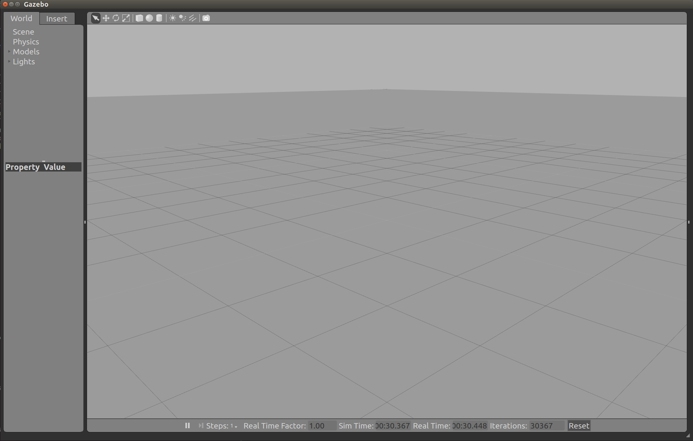
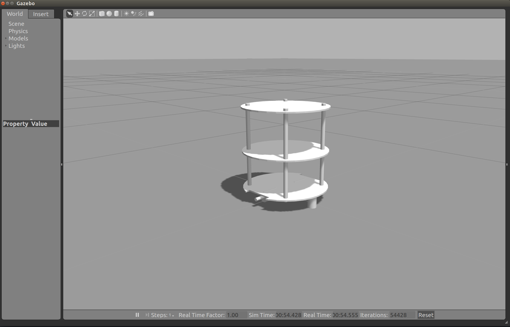
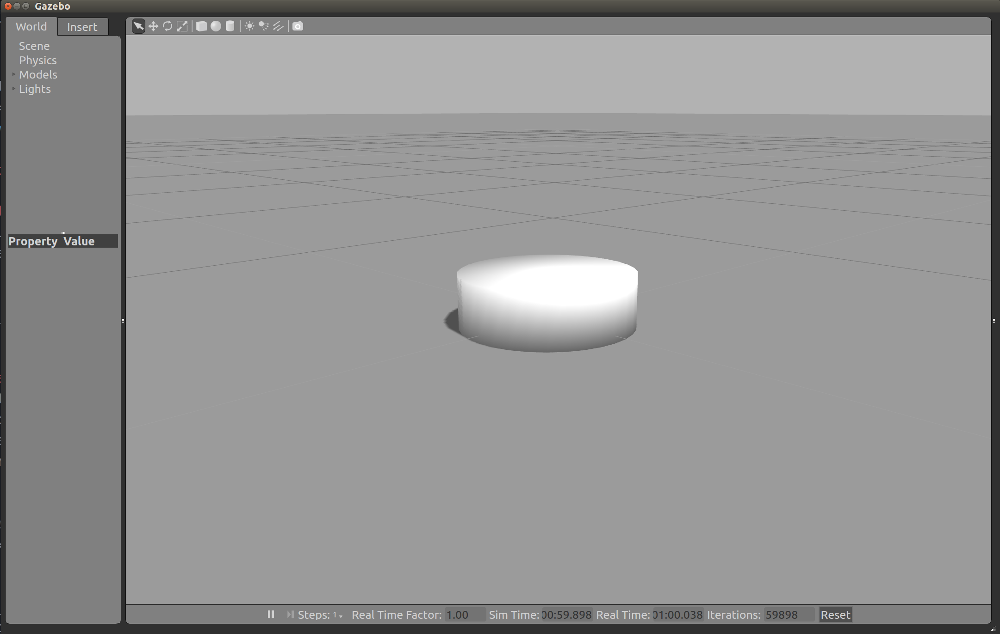

# Create Your Own Chefbot

This tutorial will show you how chefbot was created.
Chefbot is created according to the design of turtlebot.
You could find more information from the book "Learning Robotics Using Python"

## Prerequisites

### Install Turtlebot Packages

We have two methods to install Turtlebot: **From Source** or **apt Package Manager**

#### From Source

Install all dependencies(**ros-indigo-rocon** and **ros-indigo-kobuki**) using **synaptic**
```python
# open synaptic package manager
$ sudo synaptic

# search keyword ros-indigo-rocon, select all items for installation, and apply

# search keyword ros-indigo-kobuki, select all items for installation, and apply
```

Get/Install Turtlebot packages from source
```python
# create folder for turtlebot
$ mkdir ~/turtlebot

# go into the directory
$ cd ~/turtlebot

# download the latest source code of turtlebot
$ wstool init src -j5 https://raw.github.com/yujinrobot/yujin_tools/master/rosinstalls/indigo/turtlebot.rosinstall

# install all the dependencies of the source code
$ rosdep install --from-paths src -i -y

# build the source code
$ catkin_make

# to access turtlebot packages from all terminals
$ echo "source ~/turtlebot/devel/setup.bash" >> ~/.bashrc

#  execute the .bashrc file
$ source ~/.bashrc
```
#### Using apt Package Manager
This will install all the necessary packages for turtlebot
```python
$ sudo apt-get insatll ros-indigo-turtlebot ros-indigo-turtlebot-apps ros-indigo-turtlebot-interactions ros-indigo-turtlebot-simulator ros-indigo-kobuki-ftdi ros-indigo-rocon-remocon

```

#### Test Out Turtlebot
```python
# Bring up the Turtlebot simulation using ROS and Gazebo
$ roslaunch turtlebot_gazebo turtlebot_playground.launch

# On another terminal, control Turtlebot using keyboard
$ roslaunch turtlebot_teleop keyboard_teleop.launch

```

### Create Custom Robot by Cloning Turtlebot
#### Download Chefbot Source Code
```python
# we will put chefbot package in the home directory.
# You can put anywhere you want since we did not launch file from this
$ cd

# clone the complete ROS packages of the Chefbot
$ git clone https://github.com/qboticslabs/Chefbot_ROS_pkgs.git

# create chefbot folder to let us put all the packages in it
$ cd ~/catkin_ws/src
$ mkdir chefbot
$ cd chefbot
```
#### Create chefbot_gazebo package
```python
# go to chefbot directory
$ cd ~/catkin_ws/src/chefbot

# create gazebo package for chefbot
$ catkin_create_pkg chefbot_gazebo depthimage_to_laserscan diagnostic_aggregator gazebo_ros kobuki_gazebo_plugins robot_pose_ekf robot_state_publisher xacro yocs_cmd_vel_mux create_gazebo_plugins create_description create_driver create_node

** Remember to copy launch folder and world folder from the chefbot source package into chefbot_gazebo package **
# $ cp ~/Chefbot_ROS_pkgs/chefbot/chefbot_simulator/chefbot_gazebo/launch ~/catkin_ws/src/chefbot/chefbot_gazebo/launch
# $ cp ~/Chefbot_ROS_pkgs/chefbot/chefbot_simulator/chefbot_gazebo/worlds ~/catkin_ws/src/chefbot/chefbot_gazebo/worlds
```

#### Create chefbot_description package
```python
# go to chefbot directory
$ cd ~/catkin_ws/src/chefbot

# create description package for chefbot
$ catkin_create_pkg chefbot_description urdf xacro kobuki_description create_description

** remember to copy meshes, urdf, robots **
```

#### Test Out Chefbot
```python
# Build the package
$ cd ~/catkin_ws
$ catkin_make

# launch Chefbot simulation in ROS and Gazebo
$ roslaunch chefbot_gazebo chefbot_playground.launch
```


## How the Chefbot Constructs
Since we clone the files from chefbot and turtlebot packages, we will try to explain the code following how the program been called.
To do so, we will create packages to build chefbot from scratch.

### Setup
We are going to name the robot myturtle
```python
# Create a folder for our robot packages
$ cd ~/catkin_ws/src
$ mkdir myturtle
$ cd myturtle
```

Gazebo Package
```python
# create gazebo package for myturtle
$ catkin_create_pkg myturtle_gazebo depthimage_to_laserscan diagnostic_aggregator gazebo_ros kobuki_gazebo_plugins robot_pose_ekf robot_state_publisher xacro yocs_cmd_vel_mux create_gazebo_plugins create_description create_driver create_node

# create launch and worlds folders
$ cd myturtle_gazebo
$ mkdir launch worlds

# create includes folder inside launch
$ mkdir -p launch/includes
```

Description Package
```python
$ cd ~/catkin_ws/src/myturtle

# create description package for myturtle
$ catkin_create_pkg myturtle_description urdf xacro kobuki_description create_description

# create meshes, robots, urdf directories
$ cd myturtle_description
$ mkdir meshes robots, urdf
```

Build myturtle packages
```python
$ cd ~/catkin_ws
$ catkin_make
```

### Launch a Empty World in Gazebo
Create a launch file named myturtle_empty_world.launch in launch folder
```python
# Since we use atom as the editor, we could create a file by following command
$ cd ~/catkin_ws/src/myturtle/launch
$ atom myturtle_empty_world.launch
```

We will load a empty_world from gazebo_ros package  
```xml
<!-- myturtle_empty_world.launch -->
<launch>
    <!-- load an empty world -->
    <include file="$(find gazebo_ros)/launch/empty_world.launch">
      <arg name="use_sim_time" value="true"/>
      <arg name="debug" value="false"/>
    </include>
</launch>
```

Launch the empty world
```python
$ roslaunch myturtle_gazebo myturtle_empty_world.launch
```

You should see a empty world in Gazebo
<br></br>


### Build MyTurtle From Scratch

#### Build MyTurtle Base
Even though our robot is not that complicated, we should still break our robot into several files
```
The file hierarchy is going to look like this in this stage
~/catkin_ws/src/myturtle
  /myturtle_gazebo
    /launch
      /include
        myturtle_base.launch.xml
      myturtle_empty_world.launch
    CMakeList.txt
    package.xml
  /myturtle_description
    /meshes
    /robots
      myturtle_circles_kinect.xacro
    /urdf
      myturtle_base.urdf.xacro
      myturtle_library.urdf.xacro
    CMakeList.txt
    package.xml
```

##### Load MyTurtle Base in myturtle_empty_world.launch
We want to load the most basic frame of MyTurtle base into the launch file.
To let people to understand our robot structure without going through all the code,
we break down the program to several parts
```xml
<!-- myturtle_empty_world.launch -->
<launch>
  <!-- arguments that make loading different sensors easier -->
  <arg name="base"      value="$(optenv MYTURTLE_BASE myturtle_base)"/>
  <arg name="stacks"    value="$(optenv MYTURTLE_STACKS circles)"/>  <!-- circles -->
  <arg name="3d_sensor" value="$(optenv MYTURTLE_3D_SENSOR kinect)"/>  <!-- kinect, asus_xtion_pro -->

  <!-- load an empty world -->
  <include> ... </include>

  <!-- load myturtle with base, stacks shape, and 3d sensor according to specified arguments above -->
  <include file="$(find myturtle_gazebo)/launch/includes/$(arg base).launch.xml">
    <arg name="base" value="$(arg base)"/>
    <arg name="stacks" value="$(arg stacks)"/>
    <arg name="3d_sensor" value="$(arg 3d_sensor)"/>
  </include>
</launch>
```

myturtle_empty_world.launch loads the robot model by including myturtle_base.lacunch.xml, and
myturtle_base.launch.xml loads myturtle_circles_kinect.urdf.xacro as spawn model
```xml
<!-- myturtle_base.launch.xml -->
<launch>
  <!-- arguments that we passed in from myturtle_empty_world.launch -->
  <arg name="base"/>
  <arg name="stacks"/>
  <arg name="3d_sensor"/>

  <!-- load the urdf file using arguments that passed in -->
  <arg name="urdf_file" default="$(find xacro)/xacro.py '$(find myturtle_description)/robots/$(find myturtle_description)/robots/myturtle_$(arg stacks)_$(arg 3d_sensor).urdf.xacro' " />
  <!-- set parameter for the spawn_model node with argument create above(urdf_file) -->
  <param name="robot_description" command="$(arg urdf_file)" />
  <!-- load the robot description onto spawn model -->
  <node name="spawn_turtlebot_model" pkg="gazebo_ros" type="spawn_model"
        args="$(optenv ROBOT_INITIAL_POSE) -unpause -urdf -param robot_description -model mobile_base" />
</launch>
```

Since our robot is going to get really messy, we want to create file to collect all the urdf/xacro files
Therefore, we includes myturtle_library.urdf.xacro in myturtle_base_circles_kinect.urdf.xacro to access all the components(xacro:macros) of our robot model
```xml
<!-- myturtle_base_circles_kinect.urdf.xacro -->
<?xml version="1.0"?>
<!--
    Base: kobuki
    Stacks: hexagons
    3d Sensor: kinect
 -->
<robot name="turtlebot" xmlns:xacro="http://ros.org/wiki/xacro">
  <!-- myturtle_library.urdf.xacro load myturtle model, general meshes, and kinect sensor-->
  <xacro:include filename="$(find myturtle_description)/urdf/myturtle_library.urdf.xacro" />
</robot>
```

In this stage, we only need to include one urdf file to access the basic robot model
```xml
<!-- myturtle_library.urdf.xacro -->
<?xml version="1.0"?>
<robot name="myturtle" xmlns:xacro="http://ros.org/wiki/xacro">
  <!-- MyTurtle Base -->
  <xacro:include filename="$(find myturtle_description)/urdf/myturtle_base.urdf.xacro" />
</robot>
```

myturtle_base.urdf.xacro is used to describe how to robot should look like.
We will create a "kobuki" macro for the robot and load the robot base inside this macro first.
```xml
<!-- myturtle_base.urdf.xacro -->
<?xml version="1.0" ?>
<robot name="myturtle" xmlns:xacro="httpL//ros.org/wiki/xacro">

  <!--
    This is some variable that we might use later on. If we have too many variables that make the program unorganized, we will create a files just for variables.
    -->
  <xacro:property name="M_PI" value="3.1415926535897931" />

  <!-- we use macro to wrap around our robot model so that we can access it in myturtle_circles_kinect.xacro.urdf -->
  <xacro:macro name="kobuki">
    <!-- root link -->
    <link name="base_footprint"/>

    <!-- joint for base_footprint and base_link(root <- base_link) -->
    <joint name="base_joint" type="fixed">
        <origin xyz="0 0 0.0102" rpy="0 0 0" />
        <parent link="base_footprint" />
        <child link="base_link" />
    </joint>

    <link name="base_link">
      <visual>
        <!-- uncomment the code below to see how the collision model looks like -->
        <!--
        <geometry>
          <cylinder length="0.10938" radius="0.178"/>
        </geometry>
        <origin xyz="0 0 0.05949" rpy="0 0 0"/>
        -->

        <!-- myturtle base, we use chefbot's base 3D model -->
        <geometry>
          <!-- new mesh -->
          <mesh filename="package://chefbot_description/meshes/base_plate.dae" />
        </geometry>
        <origin xyz="0.001 0 -0.034" rpy="0 0 ${M_PI/2}"/>
      </visual>

      <collision>
        <geometry>
          <cylinder length="0.10938" radius="0.178"/>
        </geometry>
        <origin xyz="0.0 0 0.05949" rpy="0 0 0"/>
      </collision>

      <inertial>
        <!-- COM experimentally determined -->
        <origin xyz="0.01 0 0"/>
        <mass value="2.4"/> <!-- 2.4/2.6 kg for small/big battery pack -->
        <!-- Kobuki's inertia tensor is approximated by a cylinder with homogeneous mass distribution
             More details: http://en.wikipedia.org/wiki/List_of_moment_of_inertia_tensors
             m = 2.4 kg; h = 0.09 m; r = 0.175 m
             ixx = 1/12 * m * (3 * r^2 + h^2)
             iyy = 1/12 * m * (3 * r^2 + h^2)
             izz = 1/2 * m * r^2
          -->
        <inertia ixx="0.019995" ixy="0.0" ixz="0.0"
                 iyy="0.019995" iyz="0.0"
                 izz="0.03675" />
       </inertial>
    </link>
  </xacro:macro>
</robot>
```
Because we use macro to wrap around the robot model, we need to accessed by calling the macro(otherwise, the model won't be accessed).
```xml
<!-- myturtle_circles_kinect.urdf.xacro -->
<?xml version="1.0"?>
<robot name="turtlebot" xmlns:xacro="http://ros.org/wiki/xacro">
  <!-- myturtle_library.urdf.xacro load myturtle model, general meshes, and kinect sensor-->
  <xacro:include filename="$(find myturtle_description)/urdf/myturtle_library.urdf.xacro" />
  <!-- we simply just use the macro's name for the robot model as a element -->
  <kobuki/>
</robot>
```
The Base should look like this
<br></br>


If you want to see how the collision model looks like, we use the geometry and origin of collision model into visual.
uncomment the code in visual tag and comment the robot model(.dae) we loaded in previous section.
```xml
<!-- myturtle_base.urdf.xacro -->
<?xml version="1.0" ?>
<robot name="myturtle" xmlns:xacro="httpL//ros.org/wiki/xacro">

  ...

  <link name="base_link">
    <visual>
      <!-- uncomment the code below to see how the collision model looks like -->
      <geometry>
        <cylinder length="0.10938" radius="0.178"/>
      </geometry>
      <origin xyz="0 0 0.05949" rpy="0 0 0"/>

      <!-- myturtle base, we use chefbot's base 3D model -->
      <!--
      <geometry> ... </geometry>
      <origin />
      -->
    </visual>
    <collision> ... </collision>
    <inertial> ... </inertial>
  </link>
</robot>
```
We can see that the collision model of the base is just a simple cylinder and not as tall as the actual base model. This is because we want to use simple shape for collision model to optimize the simulation speed
<br></br>


##### Give myturtle wheels
